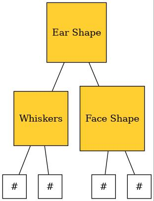

<h1 align="center"> &nbsp;&nbsp;Decision Tree Python </h1>
<br/>

> A rudimentary implementation of different Decision Tree related algorithms made in python without using any external machine learning libraries

---


# Introduction

Binary Decision Tree and Bagged Decision Trees implemented from scratch in Python

# Binary Decision Tree

Given a dataset the goal of the algorithm is to generate a Binary Decision Tree to accurately predict the value of a new example

In each iteration it calculates the entropy using the formula

> **- { x **·** log<sub>2</sub>(x)&nbsp; + &nbsp;(1 - x) **·** log<sub>2</sub>(1 - x) }**
  
where is **x** is the ratio of true cases to total cases

> <a href="https://en.wikipedia.org/wiki/Binary_entropy_function">more</a> about this formula and calculation of entropy in Binary Trees

It further calculates information gain, based on which it decides where to split

Information gain is calculated as follows:
> Assume that before splitting entropy was H<sub>root</sub> and there were n elements in total

> Now it splits at some feature and sends a and b elements to the left and right branches respectively, with their entropies being H<sub>left</sub> and H<sub>right</sub>

> gain = H<sub>root</sub> - { [ a/n ] **·** H<sub>left</sub> + [ b/n ] **·** H<sub>right</sub> }

The goal is to maximise gain each iteration and for every branch

# Bagged Decision Trees Algorithm

Given a dataset the goal of the algorithm is to generate a set of 'n' Binary Decision Trees to predict the probability of a new example being true or false

Each Binary Decision Tree is created on a unique dataset generated with sampling with replacement on the original dataset

The generation of the Binary Decision Trees follows the same process as before only with a different dataset

## Screenshots
<p>

</p>
An example result of <a href = "https://github.com/AngadBasandrai/decision-tree-python/blob/main/binarydecisiontree.ipynb">binarydecisiontree.ipynb</a> <em>(implementation of Binary Decision Tree)</em>

<br/>
<br/>

## Dependencies
 - Python 3.x
 - graphviz 9.0.0 (required only for visualisation)
 - dsplot 0.9.0 (required only for visualisation)
## Instructions

### Directions to Install
```sh
$ git clone https://github.com/AngadBasandrai/decision-tree-python.git
```

### Directions to Run
- Open .ipynb files

<hr/>

### Graphviz Installation *(required only for visualisation)*

#### Windows
- <a href="https://graphviz.org/download/">Graphviz Downloads</a>

#### Linux

- ##### Ubuntu and Debian packages
```sh
sudo apt install graphviz
```

- #### Fedora packages or RedHat Enterprise and CentOS systems
```sh
sudo yum install graphviz
```

#### Mac

- ##### <a href="https://www.macports.org/">MacPorts</a>
```sh
sudo port install graphviz
```

- ##### <a href="https://brew.sh/">HomeBrew</a>
```sh
brew install graphviz
```

### DSPlot installation *(required only for visualisation)*

- Refer to <a href="https://github.com/billtrn/dsplot/blob/master/README.md">DSPlot installation guide</a>

<hr/>


#### NOTE: The files were made in <a href="https://www.kaggle.com/"> kaggle </a> and there may be some portability issues so it is recommended to import them into kaggle
  
## Contributors
<table align="center">
	<tr align="center" style="font-weight:bold">
		<td>
		Angad Basandrai
		<p align="center">
			
		</p>
			<p align="center">
				<a href = "https://github.com/AngadBasandrai">
					
				</a>
			</p>
		</td>
	</tr>
</table>

## License
[]([http://badges.mit-license.org](https://www.gnu.org/licenses/gpl-3.0.en.html#license-text))

<p align="center">
	Made with :heart: by <a href="https://github.com/AngadBasandrai" target="_blank">Angad Basandrai</a>
</p>
